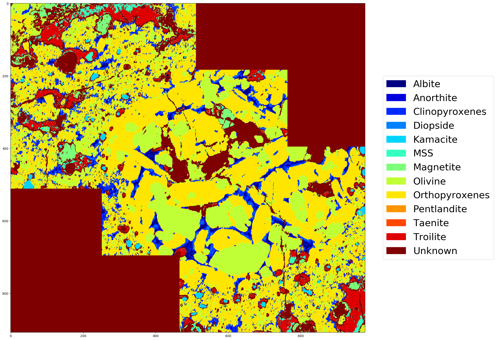

# Mineral Mapping

This is a set of scripts for classifying the minerals in object scanned by wavelength dispersive spectrometers on an electron microprobe. See this [blog post](https://towardsdatascience.com/machine-learning-meteorites-fcd8f6859ed7) and [abstract]() (Todo: Add link) for details.

In short, the script uses a set of known minerals or "standards" to determine
the calibration of the electron microprobe. Using that, it simulates target
minerals and trains a machine learning classifier on that simulated data.
It then takes the trained classifier and applies it to an image of a real,
unknown object to predict the mineral at each pixel in the image.



## Installation

`pip install -r requirements.txt`

## Usage

### Data

The `example` directory has example data for running these scripts.
There are 4 required inputs:
#### Standard Scans ([`example/standards`](example/standards))

Microprobe scans of "standard" or known minerals that will be used for
calibrating the algorithm. Given as a folder of `tif` files such as
`example/standards`. The folder contains:

* A set of files `standards_<16|32>bt_<element>.tif` for each element detected by the
  microprobe. Each file must be the same size and bit-depth. For example:
  * `standards_32bt_Al.tif` for a 32-bit scan of Aluminum
  * `standards_32bt_Fe.tif` for a 32-bit scan of Iron
  * and so on for each element that was scanned
* For each standard, there should be a `<chemical_formula>_mask.tif` mask file
which identifies where in the previous set of images each known standard is.
The mask file is an image, the same size as the element scans, which is white
where the given standard is and black everywhere else. For example,
`FeS_mask.tif` identifies where FeS is in the given standards scans.
* Optionally, include a `standards.yaml` file which details standards that don't
have a simple chemical formula. For example, San Carlos Olivine
(`SCOlv_mask.tif`) doesn't have one formula, but instead has known element
proportions. These are given in `standards.yaml`. See
[`example/standards/standards.yaml`](example/standards/standards.yaml) for more
details about how to format it.
* Optionally, include `elements.yaml` to override scanned elements or provide
values for elements that weren't included in the standard scans. See
`example/standards/elements.yaml` for more details.

#### Object Scans ([`example/meteorite`](example/meteorite))

A directory containing the microprobe scans of the object that you want to
identify the minerals in. It has one tif file for each element channel. They
should be named `<object_name>_<16|32>bt_<element>.tif` such as:
* `sem-4128-5-chm8-20170814-1umppx-32bt_32bt_Al.tif`
* `sem-4128-5-chm8-20170814-1umppx-32bt_32bt_Ca.tif`

#### Object Mask (Optional) ([`example/meteorite/mask.tif`](example/meteorite/mask.tif))

If you care about a particular part of the object image, you can optionally
include a mask of the object, similar to the masks used for the standards.
It must be the same size as the object element images, is white in the area
of interest, and black elsewhere.

#### Target Mineral Definition ([`example/targets.yaml`](example/targets.yaml))

The target mineral file defines the minerals that you are looking for in your
object. See [`example/targets.yaml`](example/targets.yaml) for details on how
to create the file.

### Running

Basic usage is:

`python scripts/main.py standards_dir meteorite_dir target_minerals_file output_dir`

For example:

`python scripts/main.py example/standards/ example/meteorite/ example/targets.yaml example/output`

#### Outputs

The above command creates a directory, `example/output`, with three files:
* `figure.png`: An image which maps the locations of each target mineral in the
given object.
* `mineral_counts.csv`: A CSV which lists the number of pixels identified as
each mineral in the object.
* `parameters.yaml`: A file which contains the input parameters for debugging.

#### Masks

If you only care about a specific part of the object image, you can also provide
a mask using the `--mask` flag. For example:

`python scripts/main.py --mask example/meteorite/mask.tif example/standards/ example/meteorite/ example/targets.yaml example/output`

This creates two extra outputs: `figure_masked.png` and `mineral_counts_masked.csv`.

#### Debugging

When running, the script will print out some diagnostic information such as:
* `WARNING:root:TiO2 Ti channel STD > 20 (23.811946009290125)`
  * This means that there is a lot of noise in the reads of `Ti` in the `TiO2` standard,
  which might lead to poor classification of minerall with `Ti`.
* `WARNING:root:apatite Si channel values unexpectedly high (mean = 86.58719157194345)`
  * This warning means that there were high readings for `Si` in a standard
  that isn't expected to have any `Si` in it.
* `WARNING:root:Si noise > 5 (30.90611095888168)`
  * This warning means that there is a lot of background noise in an element channel.

The script will also report the training and testing accuracy for the
classification model. This is not the accuracy on the object you're trying
to map, but the accuracy on the simulated data. So this can only help you
ensure that your classifier has a good potential of working well on the real
object.

```
Training Classifier...
Training Accuracy: 0.9317734375
Testing Accuracy: 0.92325
```

You want to make sure that the testing accuracy is as high as possible and that
it's close to the same value as the training accuracy.

#### Changing the classification algorithm

By default, the script uses a gaussian naive bayes classifier with 100 samples.
This is fast, but not robust.
To change the model, use the `--model` flag when running. The script natively
supports using random forest (`--model RandomForest`) as well as the ability to
define your own model using the following scikit-learn models:
* [`AdaBoostClassifier`](https://scikit-learn.org/stable/modules/generated/sklearn.ensemble.AdaBoostClassifier.html)
* [`BaggingClassifier`](https://scikit-learn.org/stable/modules/generated/sklearn.ensemble.BaggingClassifier.html)
* [`DecisionTreeClassifier`](https://scikit-learn.org/stable/modules/generated/sklearn.tree.DecisionTreeClassifier.html)
* [`GaussianNB`](https://scikit-learn.org/stable/modules/generated/sklearn.naive_bayes.GaussianNB.html)
* [`GaussianProcessClassifier`](https://scikit-learn.org/stable/modules/generated/sklearn.gaussian_process.GaussianProcessClassifier.html)
* [`KNeighborsClassifier`](https://scikit-learn.org/stable/modules/generated/sklearn.neighbors.KNeighborsClassifier.html)
* [`MLPClassifier`](https://scikit-learn.org/stable/modules/generated/sklearn.neural_network.MLPClassifier.html)
* [`RandomForestClassifier`](https://scikit-learn.org/stable/modules/generated/sklearn.ensemble.RandomForestClassifier.html)
* [`SVC`](https://scikit-learn.org/stable/modules/generated/sklearn.svm.SVC.html)


There are two more parameters for tweaking the classification:
* `--n` which changes the number of samples used for training. The higher the
more robust the classification will be, but at the cost of memory and time.
* `--unknown_n` changes the number of "Unknown" samples used for training.
This allows for the model to classify some pixels as "unknown" or not matching
any of the target minerals. By default, `unknown_n` is the same as `n`.
Making it larger will make the model more conservative and identify more
minerals as "unknown."

An example using these parameters is:

`python scripts/main.py --n 10000 --unknown_n 20000 --model "KNeighborsClassifier(10)" example/standards/ example/meteorite/ example/targets.yaml example/output`

### Command Line Arguments

For a full list of command line arguments, run `python scripts/main.py -h`:

```
usage: main.py [-h] [--mask MASK] [--title TITLE] [--n N]
               [--unknown_n UNKNOWN_N] [--model MODEL]
               [--batch_size BATCH_SIZE] [--bits {8,32}]
               [--output_prefix OUTPUT_PREFIX]
               standards_dir meteorite_dir target_minerals_file output_dir

Predict the mineral content of a meteorite given spectrometer imagery.

positional arguments:
  standards_dir         path to directory containing the standards
  meteorite_dir         path to directory containing the meteorite images
  target_minerals_file  A YAML file containing the minerals to search for
  output_dir            The directory to write the outputs to.

optional arguments:
  -h, --help            show this help message and exit
  --mask MASK           An optional mask to use for the meteorite.
  --title TITLE         An optional title to put on the output image.
  --n N                 The number of samples to simulate. (Default 100) The
                        higher the number, the more robust the predictions,
                        but the longer it will take.
  --unknown_n UNKNOWN_N
                        The number of samples to use for "Unknown." The higher
                        the number relative to n, the more likely that a pixel
                        will be classified as "Unknown". Set to 0 to disable
                        Unknown classifications. (Default to the same as n.)
  --model MODEL         A classification algorithm to use. Either
                        "RandomForest" or "GaussianNB" or a string which can
                        be evaluated to a sklearn model such as
                        "KNeighborsClassifier(10)". (Default GaussianNB)
  --batch_size BATCH_SIZE
                        The batch size to use for prediction. If you're
                        getting a `MemoryError`, try turning it down. (Default
                        100000)
  --bits {8,32}         image bit-depth to use (8 or 32)
  --output_prefix OUTPUT_PREFIX
                        Prefix each output file with the given string.
                        (Default '')
```


### Batch Mode

`scripts/batch.py` supports running the classification is batch mode by providing
a CSV file describing the parameters. The CSV file can have column headings for
any of the parameters available to `scripts/main.py`.
[`example/batch.csv`](example/batch.csv) gives an example of the batch CSV.

Running with `scripts/batch.py example/batch.csv` produces a directory called
`example/batch_output` with a series of subdirectories containing each
individual run.

You can put comma-separated values in each cell to vary some values without
having to create a whole new row. For example, you might want to try several
different values for `n` for a particular setup.

## Acknowledgments

This project was started during the American Museum of Natural History 2019 Hackathon (Hack the Solar System), addressing the challenge [Meteorite Mineral Mapping](https://github.com/amnh/HackTheSolarSystem/wiki/Meteorite-Mineral-Mapping).

The team was:
* [Jeremy Neiman](https://github.com/docmarionum1)
* [Peter Kang](https://github.com/kangp3)
* [Cecina Babich Morrow](https://github.com/babichmorrowc)
* [Katy Abbott](https://github.com/katyabbott)
* Meret Götschel
* Jackson Lee
* [John Underwood](https://github.com/jwunder127)

With advising from:
* [Samuel Alpert](https://www.amnh.org/research/staff/samuel-alpert)
* [Marina Gemma](https://www.amnh.org/research/staff/marina-gemma)
* [Denton Ebel](https://www.amnh.org/research/staff/denton-s.-ebel)
